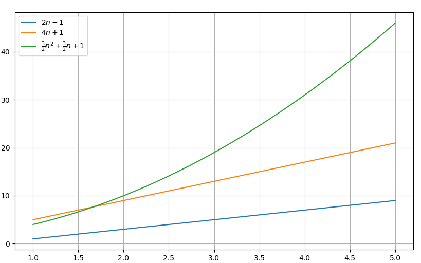

# Big-O 표기법

## Big-O 표기법
- 알고리즘의 수행시간 : 최악의 경우의 입력에 대한 기본연산 횟수  

1. 알고리즘1 (ArrayMax): $T1(n) = 2n -1$
2. 알고리즘2 (sum1): $T2(n) = 4n+1 $
3. 알고리즘3 (sum2): $T3(n) = \tfrac{3}{2} n^2 + \tfrac{3}{2} n + 1$

<br>

### 예시



1. 알고리즘2는 알고리즘1보다 2배 **느리다**
2. 알고리즘3는 n < $\frac{5}{3}$ 면 알고리즘2보다 **빠르다**
3. 알고리즘3는 n > $\frac{5}{3}$ 면 항상 알고리즘2보다 **느리다**  
&rightarrow; 최고차항이 얼마인지에 따라 증가율이 달라진다

 * 수행시간 $T(n)$ = 함수 값을 결정하는 <u>최고차항</u> 만으로 간단하게 표기 : <u>Big-O표기법</u>
    * $T1(n) = 2n -1$ &rightarrow; $ O(n)$
    * $T2(n) = 4n + 1$ &rightarrow; $O(n)$
    * $T3(n) = \tfrac{3}{2} n^2 + \tfrac{3}{2} n + 1$ &rightarrow;  $O(n^2)$


### 예시
```python
def number_of_bits(n):
    cnt = 0
    while n > 0:
        n = n // 2
        cnt += 1
    return cnt
print(number_of_bits(8))
``` 
- n이 0이 될 때까지 진행
- n &rightarrow; $\frac{n}{2}$ &rightarrow; $\frac{n}{2^2}$ &rightarrow; ... &rightarrow; 1 &rightarrow; 0
- 반복횟수는 대략 $\log_2 n$
- 시간복잡도 : $O(\log_2 n)$


### 시간복잡도 집합
