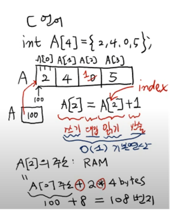
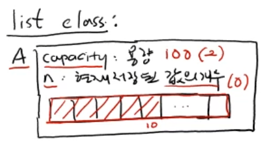

# 배열 vs 리스트
 - 가장 기본적인  순차적인(sequential) 자료구조

```c
int A[4] = {2,4,0,5};
```
- A라는 변수에는 A[0]의 첫번째바이트의 주소가 저장되어있다
- A[2] = A[2] + 1
- 읽기, 쓰기, 산술, 대입연산 &rightarrow; $O(1)$
- A[2]의 주소 : RAM
    - A[0]의 주소 + 2 * 4byte
    - A[2]의 주소를 읽기 위해서 +, * 연산을 하였다.
    - index를 활용하여 상수시간안에 읽어올수 있다.
- 파이썬에서는 list를 제공한다  
<br>
<br>

## list

```python
A = [2,4,0,5]
```
- A[2] = A[2] + 1 을 할때 0이 1로 바뀌는게 아니고, 1의 객체가 생성되고, <u>A[2]가 객체 1을 가리킨다.</u>
- A.append(6) : 맨 뒤에 6을 삽입 &rightarrow; 객체 6이 생성되고 A[4]가 객체 6을 가리킨다.
- A.pop() : 맨 뒤에 값을 지우고 리턴한다
- A.pop(1) : A[1]을 제거하고 리턴한다
- A.insert(1, 10) : A[1]에 10을 삽입
- A.remove(value) : A에서 vlaue 제거
- A.index(value)
- A.count(value)  

### 용량 자동조절 (dynamic array)

```c
int A[4] = {2,4,0,5};
A[4] = 10;
```
&rightarrow; 에러 발생 (메모리 영역이 없는 10을 저장해서)  
<br>
```c
B = (int*) malloc(6*4)
A = B
```
- 24바이트 해당되는 메모리를 할당해서 시작주소를 B에 저장  
<br>

```python
import sys
A = [] #빈 리스트
print(sys.getsizeof(A)) #56
A.append(10) A=[10]
print(sys.getsizeof(A)) #88byte
```

<br>


```python
A.append(X):
    if A.n < A.capacity:
        A[n] = x
        A.n = n + 1
    else:
        A.n == A.capacity
        B = A.capacity * 2 크기의 리스트 새로 할당
    for i in range(n):
        B[i] = A[i]
    del A
    A = B
    A[n] = X
    A.n = n + 1
``` 