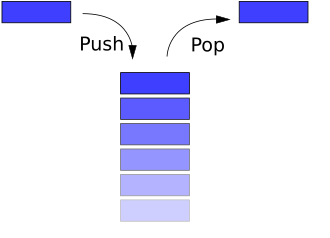
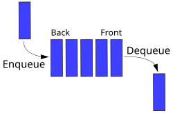
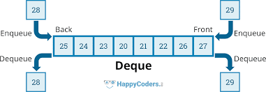
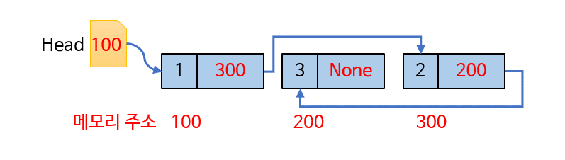

# 순차적 자료구조 소개

## 1. 배열, 리스트
- index로 임의의 원소 접근
- 연산자 A[2]  :  $O(1)$
- 삽입 (append, insert)
- 삭제 (pop, remove )

## 2. stack, queue, deque
- 제한된 접근(삽입, 삭제)만 허용
### 1. stack
- LIFO : Last In First Out
 

### 2. queue
- FIFO : First In First Out
 

### 3. dequeue
- stack + queue
 
  

### 4. linked list(연결리스트)
- 각 노드는 값과 다음  노드의 주소를 저장
- head는 연결 리스트의 첫 번째 노드를 가리키며, 연결 리스트에 접근하기 위한 시작점 역할
 