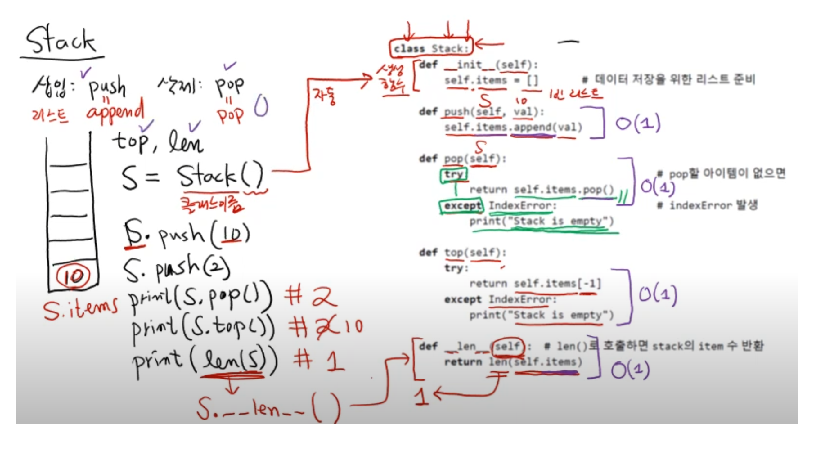

# Stack

- 삽입: push == append(리스트)
- 삭제: pop == pop(리스트)
- top: 맨 위의 원소 확인
- len: 길이 확인

<br>

```python
class Stack:
    def __init__(self): #생성함수
        self.items = []    #데이터 저장을 위한 리스트 준비
    
    def push(self, val):
        self.items.append(val)
    
    def pop(self):
        try:
            return self.items.pop()
        except IndexError:
            print("Stack is empty")
    
    def top(self):
        try:
            return self.items[-1]
        except IndexError:
            print("Stack is empty")
    
    def __len__(self):    #len()로 호출하면 stack의 item 수 반환
        return len(self.items)

S = Stack()
S.push(10)
S.push(2)
print(S.pop()) #2
print(S.top()) #10
print(len(S)) #1 
```

- 수행시간
    - push: $O(1)$
    - pop: $O(1)$
    - top: $O(1)$
    - len: $O(1)$  
<br>
